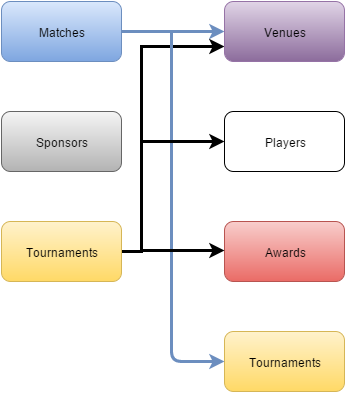

Parts Implemented by ANIL YILDIRIM
==================================

Database Tables
---------------

      Fig. 1: Entity Relationship Diagram of the Matches/Sponsors/Tournaments tables.

3 tables are used to represent Matches/Sponsors/Tournaments data.
Matches references Venues and Tournaments.
Sponsors has no reference.
Tournaments references Venues, Players and Awards.

Matches:
********

.. code-block:: plpgsql

   CREATE TABLE matches (ID VARCHAR(100) NOT NULL,
   TournamentID VARCHAR(100) REFERENCES tournaments (ID),
   VenueID VARCHAR(100) REFERENCES venues (ID),
   Player1 VARCHAR(100) REFERENCES players (ID),
   Player2 VARCHAR(10) REFERENCES players (ID),
   IsLive VARCHAR(1),
   Score VARCHAR(10),
   PRIMARY KEY (ID))

Matches table holds the information about matches, it has 3 columns which are foreign keys.
Tournament is the tournament which the related match belongs to.
Venue is the place where the match is held.
Player1 and Player2 are the player ID's.
Is Live is the field to store if the Match is live or not.
Score is the field to store the score of the match.
VenueID is used to reach the venue data from Venues table.
Player1 and Player2 are used to reach the players data from Players table.

Sponsors:
*********

.. code-block:: plpgsql

   CREATE TABLE sponsors ( ID VARCHAR(100) NOT NULL,
   Name VARCHAR(100),
   ImageUrl VARCHAR,
   ExternalUrl VARCHAR,
   PRIMARY KEY (ID))

Sponsors table holds the information about sponsors, it has no foreign keys.
Name contains the name of the Brand.
Image URL contains a URL to the logo of the brand.
External URL contains a URL to the website of the brand.

Tournaments
***********

.. code-block:: plpgsql

      CREATE TABLE tournaments (ID VARCHAR(100) NOT NULL,
      Name VARCHAR(100),
      VenueID VARCHAR(100) REFERENCES venues (ID),
      Round VARCHAR(20),
      PlayerCound int,
      LastWinnerID VARCHAR(100) REFERENCES players (ID),
      AwardID VARCHAR(100) REFERENCES awards (ID),
      PRIMARY KEY (ID))

Tournaments table holds the information about tournaments, it has 3 columns which are foreign keys.
Name contains the name of the tournament.
Venue contains the place where the tournament is held.
Round is responsible for storing number of rounds for this tournament.
Player count is the total number of player attending to this tournament.
Last winner is the player ID of the player that won the tournament last time.
Award is the name of the award that will be given to the winner.
VenueID is used to reach the venue data from Venues table.
LastWinnerID is used to reach the players data from Players table.

Class file of Matches:
**********************
.. code-block:: python

   class Match:

    def __init__(self, id, tournamentID, venueID, player1, player2, isLive, score):
        self.ID = id
        self.TournamentID = tournamentID
        self.VenueID = venueID
        self.Player1 = player1
        self.Player2 = player2
        self.IsLive = isLive
        self.Score = score
        self.TournamentName = " "
        self.VenueName = " "
        self.Player1Name = " "
        self.Player2Name = " "

    def getID(self):
        return self.ID

    def getTournamentID(self):
        return self.TournamentID

    def getTournamentName(self):
        return self.TournamentName

    def getVenueID(self):
        return self.VenueID

    def getVenueName(self):
        return self.VenueName

    def getPlayer1(self):
        return self.Player1

    def getPlayer1Name(self):
        return self.Player1Name

    def getPlayer2(self):
        return self.Player2

    def getPlayer2Name(self):
        return self.Player2Name

    def isLive(self):
        return self.IsLive

    def getScore(self):
        return self.Score

Class file of Sponsors:
***********************
.. code-block:: python

   class Sponsor:

    def __init__(self, id, name, image_url, ext_url):
        self.ID = id
        self.Name = name
        self.ImageUrl = image_url
        self.ExtUrl = ext_url

    def getID(self):
        return self.ID

    def getName(self):
        return self.Name

    def getImageUrl(self):
        return self.ImageUrl

    def getExtUrl(self):
        return self.ExtUrl

Class file of Tournaments:
**************************

.. code-block:: python

   class Tournament:

    def __init__(self, id, name, venueID, round, player_count, last_winnerID, awardID):
        self.ID = id
        self.Name = name
        self.VenueID = venueID
        self.Round = round
        self.PlayerCount = player_count
        self.LastWinnerID = last_winnerID
        self.AwardID = awardID
        self.VenueName = " "
        self.LastWinnerName = " "
        self.AwardName = " "

    def getID(self):
        return self.ID

    def getName(self):
        return self.Name

    def getVenueID(self):
        return self.VenueID

    def getVenueName(self):
        return self.VenueName

    def getRound(self):
        return self.Round

    def getPlayerCount(self):
        return self.PlayerCount

    def getLastWinnerID(self):
        return self.LastWinnerID

    def getLastWinnerName(self):
        return self.LastWinnerName

    def getAwardID(self):
        return self.AwardID

    def getAwardName(self):
        return self.AwardName

Matches related part of server.py file:
***************************************

.. code-block:: python

   @app.route('/matches')
   def fmatches():
   with dbapi2.connect(app.config['dsn']) as connection:
        _matchList = dbmanager.getMathes(connection)
        _sponsorList = dbmanager.getSponsor(connection)
        _channelList = dbmanager.getChannels(connection)
        _info = layoutInfo('Looking for perfection is the only way.','RONNIE O-SULLIVAN','static/img/players.jpg')
        return render_template('fmatches.html', matchList = _matchList, info = _info, sponsorList = _sponsorList, channelList = _channelList)

   @app.route('/admin_panel/match', methods=['GET','POST'])
   def addMatch():
   with dbapi2.connect(app.config['dsn']) as connection:
        if(request.method == 'GET'):
            _matchList = dbmanager.getMathes(connection)
            return render_template('match.html', matchList = _matchList)

        if(request.form["action"] == "Add Match"):
            dbmanager.addMatch(request.form['add_tournamentName'], request.form['add_venueName'], request.form['add_player1'],request.form['add_player2'], request.form['add_isLive'], request.form['add_score'],connection)
            return redirect(url_for('addMatch'))

        if(request.form["action"] == "Delete"):
            dbmanager.deleteVideo(request.form['id'], connection)
            return redirect(url_for('addMatch'))

        return render_template('match.html')

Sponsors related part of server.py file:
****************************************
.. code-block:: python

   @app.route('/admin_panel/sponsor', methods=['GET','POST'])
   def sponsor():
    with dbapi2.connect(app.config['dsn']) as connection:
        if(request.method == 'GET'):
            _sponsorList = dbmanager.getSponsor(connection)
            return render_template('sponsor.html', sponsorList = _sponsorList)

        if(request.form["action"] == "add_sponsor_action"):
            dbmanager.addSponsor(request.form['add_name'], request.form['add_imageURL'], request.form['add_extURL'], connection)
            return redirect(url_for('sponsor'))

        if(request.form["action"] == "delete_sponsor_action"):
            dbmanager.deleteSponsor(request.form['id'], connection)
            return redirect(url_for('sponsor'))

        return render_template('sponsor.html')

Tournaments related part of server.py file:
*******************************************
.. code-block:: python

   @app.route('/tournaments')
   def ftournaments():
   with dbapi2.connect(app.config['dsn']) as connection:
        _tourList = dbmanager.getTournaments(connection)
        _sponsorList = dbmanager.getSponsor(connection)
        _channelList = dbmanager.getChannels(connection)
        _info = layoutInfo('Snooker is about having the best offensive play possible.','RONNIE O-SULLIVAN','static/img/players.jpg')
        return render_template('ftournament.html', tournamentList = _tourList, info = _info, sponsorList = _sponsorList, channelList = _channelList)

   @app.route('/admin_panel/tournament', methods=['GET','POST'])
   def tournament():
   with dbapi2.connect(app.config['dsn']) as connection:
        if(request.method == 'GET'):
            _tournamentList = dbmanager.getTournaments(connection)
            return render_template('tournament.html', tournamentList = _tournamentList)

        if(request.form["action"] == "add_sponsor_action"):
            dbmanager.addTournament(request.form['add_name'], request.form['add_venueName'], request.form['add_round'],request.form['add_player_count'], request.form['add_lastWinnerName'], request.form['add_awardName'], connection)
            return redirect(url_for('tournament'))

        if(request.form["action"] == "delete_sponsor_action"):
            dbmanager.deleteTournament(request.form['id'], connection)
            return redirect(url_for('tournament'))

        return render_template('tournament.html')

Matches related part of dbmanager.py file:
******************************************
.. code-block:: python

   def createMatchTable():

    conn = psycopg2.connect(conn_string)

    cursor = conn.cursor()

    cursor.execute("CREATE TABLE matches (ID VARCHAR(100) NOT NULL,TournamentID VARCHAR(100) REFERENCES tournaments (ID),VenueID VARCHAR(100) REFERENCES venues (ID),Player1 VARCHAR(100) REFERENCES players (ID),Player2 VARCHAR(10) REFERENCES players (ID),IsLive VARCHAR(1),Score VARCHAR(10),PRIMARY KEY (ID))")

    conn.commit()

   def getMathes(conn):

    cursor = conn.cursor()

    cursor.execute("SELECT * FROM matches ")

    matchList = []

    row = cursor.fetchone()
    while row:

       match = Match(row[0],row[1],row[2],row[3],row[4],row[5],row[6])

       match.TournamentName = getTournament(match.getTournamentID(), conn).Name
       match.VenueName = getVenue(match.getVenueID(), conn).Name

       matchList.append(match)

       row = cursor.fetchone()

    return matchList

   def addMatch(tournament_name, venue_name, player_name1, player_name2, isLive, score, conn):

    try:

        cursor = conn.cursor()

        cursor.execute("SELECT ID FROM venues WHERE name = '%s'"%(venue_name))

        venue_id = cursor.fetchone()

        cursor.execute("SELECT ID FROM players WHERE name = '%s'"%(player_name1))

        player_id = cursor.fetchone()

        cursor.execute("SELECT ID FROM players WHERE name = '%s'"%(player_name2))

        player_id2 = cursor.fetchone()

        cursor.execute("SELECT ID FROM tournaments WHERE name = '%s'"%(tournament_name))

        award_id = cursor.fetchone()

        cursor.execute("INSERT INTO matches VALUES('%s','%s','%s','%s','%s','%s','%s')"%(utils.generateID(), tournament_name, venue_name, player_name1, player_name2, isLive, score))

        conn.commit()

    except Exception as e:
        print(str(e))
        pass

   def deleteMatch(id, conn):

    cursor = conn.cursor()

    cursor.execute("DELETE FROM matches WHERE id = '%s'"%(id))

    conn.commit()

Sponsors related part of dbmanager.py file:
*******************************************
.. code-block:: python

   def createSponsorTable():

    conn = psycopg2.connect(conn_string)

    cursor = conn.cursor()

    cursor.execute("CREATE TABLE sponsors ( ID VARCHAR(100) NOT NULL,Name VARCHAR(100),ImageUrl VARCHAR,ExternalUrl VARCHAR,PRIMARY KEY (ID))")

    conn.commit()

   def getSponsor(conn):

    cursor = conn.cursor()

    cursor.execute("SELECT * FROM sponsors")

    sponsorList = []

    row = cursor.fetchone()
    while row:

       sponsor = Sponsor(row[0],row[1],row[2],row[3])

       sponsorList.append(sponsor)

       row = cursor.fetchone()

    return sponsorList

   def addSponsor(name, image_url, ext_url, conn):

    try:

        cursor = conn.cursor()

        cursor.execute("INSERT INTO sponsors VALUES('%s','%s','%s','%s')"%(utils.generateID(), name, image_url, ext_url))

        conn.commit()

    except Exception as e:
        print(str(e))
        pass

   def deleteSponsor(id, conn):

    cursor = conn.cursor()

    cursor.execute("DELETE FROM sponsors WHERE id = '%s'"%(id))

    conn.commit()

Tournaments related part of dbmanager.py file:
**********************************************
.. code-block:: python

   def createTournamentTable():

    conn = psycopg2.connect(conn_string)

    cursor = conn.cursor()

    cursor.execute("CREATE TABLE tournaments (ID VARCHAR(100) NOT NULL,Name VARCHAR(100),VenueID VARCHAR(100) REFERENCES venues (ID),Round VARCHAR(20),PlayerCound int,LastWinnerID VARCHAR(100) REFERENCES players (ID),AwardID VARCHAR(100) REFERENCES awards (ID),PRIMARY KEY (ID))")

    conn.commit()

   def getTournaments(conn):

    cursor = conn.cursor()

    cursor.execute("SELECT * FROM tournaments ")

    tournamentList = []

    row = cursor.fetchone()
    while row:

       tournament = Tournament(row[0],row[1],row[2],row[3],row[4],row[5],row[6])

       tournamentList.append(tournament)

       row = cursor.fetchone()

    for temp_tournament in tournamentList:

        cursor.execute("SELECT name FROM venues WHERE id='%s'"%(temp_tournament.getVenueID()))

        row2 = cursor.fetchone()

        temp_tournament.VenueName = row2[0]

        cursor.execute("SELECT firstname,lastname FROM players WHERE id='%s'"%(temp_tournament.getLastWinnerID()))

        row3 = cursor.fetchone()

        temp_tournament.LastWinnerName = row3[0] + " " + row3[1]

        cursor.execute("SELECT description FROM awards WHERE id='%s'"%(temp_tournament.getAwardID()))

        row4 = cursor.fetchone()

        temp_tournament.AwardName = row4[0]

    return tournamentList

   def getTournament(id, conn):

    cursor = conn.cursor()

    cursor.execute("SELECT * FROM tournaments WHERE id = '%s'"%(id))

    row = cursor.fetchone()

    tournament = Tournament(row[0],row[1],row[2],row[3],row[4],row[5],row[6])

    return tournament

   def addTournament(name, venue_name, round, player_count, last_winner_name, award_name, conn):

    try:

        cursor = conn.cursor()

        cursor.execute("SELECT ID FROM venues WHERE name = '%s'"%(venue_name))

        venue_id = cursor.fetchone()

        cursor.execute("SELECT ID FROM players WHERE name = '%s'"%(last_winner_name))

        player_id = cursor.fetchone()

        cursor.execute("SELECT ID FROM awards WHERE name = '%s'"%(award_name))

        award_id = cursor.fetchone()

        cursor.execute("INSERT INTO tournaments VALUES('%s','%s','%s','%s','%s','%s','%s')"%(utils.generateID(), name, venue_id, round, player_count, player_id, award_id))

        conn.commit()

    except Exception as e:
        print(str(e))
        pass

   def deleteTournament(id,conn):

    cursor = conn.cursor()

    cursor.execute("DELETE FROM tournaments WHERE id = '%s'"%(id))

    conn.commit()

