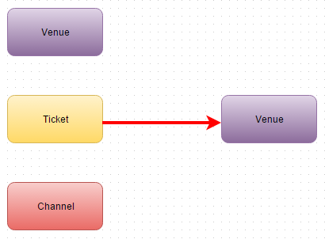

Parts Implemented by İLKER YAĞMUR
=================================

Database Tables
---------------

      Fig. 1: Entity Relationship Diagram of the Venue/Ticket/Channel tables.

3 tables are used to represent Venue/Ticket/Channel data.
Venue has no reference.
Ticket references Venue.
Channel has no reference.

Venue:
******

.. code-block:: plpgsql

   CREATE TABLE venues ( ID VARCHAR(100) NOT NULL,
   Name VARCHAR(100),
   Capacity int,
   Location VARCHAR(30),
   Description VARCHAR(250),
   PRIMARY KEY (ID))

Venue table holds the information about venues, it has no foreign keys.
Name contains the name of the venue.
Capacity states the number of people that venue can carry.
Location is the country which venue takes place.
Description is brief information about venue.

Ticket:
*******

.. code-block:: plpgsql

   CREATE TABLE tickets (ID VARCHAR(100) NOT NULL,
   VenueID VARCHAR(100) REFERENCES venues (ID),
   Title VARCHAR(100),
   Description VARCHAR(250),
   Price VARCHAR(10),
   Date VARCHAR(20),
   ExtUrl VARCHAR,
   PRIMARY KEY (ID))

Ticket table holds the information about tickets, has one foreign key.
Venue is the place where event of the ticket held.
Title contains name of the event that ticket belongs to.
Description contains a summary of the event.
Price shows how much the ticket costs.
Date shows the time interval when the event held.
Extarnel Url shows the web address of the event.

Channel
*******

.. code-block:: plpgsql

   CREATE TABLE channels (ID VARCHAR(100) NOT NULL,
   Name VARCHAR(100),
   ImageUrl VARCHAR,
   ExtUrl VARCHAR,
   PRIMARY KEY (ID))

Channel table holds the information about channels, it has no foreign keys.
Name contains the name of the channel.
Image Url contains address of channel logo.
External Url contains a Url to reach the channel website.

Class file of Venue:
********************
.. code-block:: python

    class Venue:

    def __init__(self, id, name, capacity, location, description):
        self.ID = id
        self.Name = name
        self.Capacity = capacity
        self.Location = location
        self.Description = description

    def getID(self):
        return self.ID

    def getName(self):
        return self.Name

    def getCapacity(self):
        return self.Capacity

    def getLocation(self):
        return self.Location

    def getDescription(self):
        return self.Description

Class file of Ticket:
*********************
.. code-block:: python

    class Ticket:

    def __init__(self, id, venue_id, title, content, price, date, ext_url):
        self.ID = id
        self.VenueID = venue_id
        self.Title = title
        self.Content = content
        self.Price = price
        self.Date = date
        self.ExtUrl = ext_url
        self.VenueName = " "

    def getID(self):
        return self.ID

    def getVenueID(self):
        return self.VenueID

    def getVenueName(self):
        return self.VenueName

    def getTitle(self):
        return self.Title

    def getContent(self):
        return self.Content

    def getPrice(self):
        return self.Price

    def getDate(self):
        return self.Date

    def getExtUrl(self):
        return self.ExtUrl

Class file of Channel:
**********************

.. code-block:: python

    class Channel:

    def __init__(self, id, name, image_url, ext_url):
        self.ID = id
        self.Name = name
        self.ImageUrl = image_url
        self.ExtUrl = ext_url

    def getID(self):
        return self.ID

    def getName(self):
        return self.Name

    def getImageUrl(self):
        return self.ImageUrl

    def getExtUrl(self):
        return self.ExtUrl

Venue related part of server.py file:
*************************************

.. code-block:: python

   @app.route('/admin_panel/venue', methods=['GET','POST'])
   def venue():
   with dbapi2.connect(app.config['dsn']) as connection:
        if(request.method == 'GET'):
            _venueList = dbmanager.getVenues(connection)
            return render_template('venue.html', venueList = _venueList)

        if(request.form["action"] == "add_venue_action"):
            dbmanager.addVenue(request.form['add_name'], request.form['add_capacity'], request.form['add_location'], request.form['add_desc'], connection)
            return redirect(url_for('venue'))

        if(request.form["action"] == "delete_venue_action"):
            dbmanager.deleteVenue(request.form['id'], connection)
            return redirect(url_for('venue'))

Ticket related part of server.py file:
**************************************
.. code-block:: python

    @app.route('/admin_panel/ticket', methods=['GET','POST'])
    def ticket():
    with dbapi2.connect(app.config['dsn']) as connection:
        if(request.method == 'GET'):
            _ticketList = dbmanager.getTickets(connection)
            return render_template('ticket.html', ticketList = _ticketList)

        if(request.form["action"] == "add_ticket_action"):
            dbmanager.addTicket(request.form['add_ticket_venue'], request.form['add_ticket_title'], request.form['add_ticket_content'],request.form['add_ticket_price'], request.form['add_ticket_exturl'], request.form['add_ticket_date'],connection)
            return redirect(url_for('ticket'))

        if(request.form["action"] == "delete_ticket_action"):
            dbmanager.deleteTicket(request.form['id'], connection)
            return redirect(url_for('ticket')))

Channel related part of server.py file:
***************************************
.. code-block:: python

    @app.route('/channel)
    def channel():
    with dbapi2.connect(app.config['dsn']) as connection:
        if(request.method == 'GET'):
            _channelList = dbmanager.getChannels(connection)
            return render_template('channel.html', channelList = _channelList)

        if(request.form["action"] == "Add Channel"):
            dbmanager.addChannel(request.form['add_channel_name'], request.form['add_channel_imageurl'], request.form['add_channel_exturl'], connection)
            return redirect(url_for('channel'))

        if(request.form["action"] == "Delete"):
            dbmanager.deleteChannel(request.form['id'], connection)
            return redirect(url_for('channel'))

        return render_template('channel.html'))

Venue related part of dbmanager.py file:
****************************************
.. code-block:: python

    def createVenueTable():

    conn = psycopg2.connect(conn_string)

    cursor = conn.cursor()

    cursor.execute("CREATE TABLE venues ( ID VARCHAR(100) NOT NULL,Name VARCHAR(100),Capacity int,Location VARCHAR(30),Description VARCHAR(250),PRIMARY KEY (ID))")

    conn.commit()

    def getVenues(conn):

    cursor = conn.cursor()

    cursor.execute("SELECT * FROM venues ")

    venueList = []

    row = cursor.fetchone()
    while row:

       temp_venue = Venue(row[0],row[1],row[2],row[3],row[4])

       venueList.append(temp_venue)

       row = cursor.fetchone()

    return venueList

    def getVenue(id, conn):

    cursor = conn.cursor()

    cursor.execute("SELECT * FROM venues WHERE id = '%s'"%(id))

    row = cursor.fetchone()

    venue = Venue(row[0],row[1],row[2],row[3],row[4])

    return venue

    def addVenue(name, capacity, location, description, conn):

    try:

        cursor = conn.cursor()

        cursor.execute("INSERT INTO venues VALUES('%s','%s','%s','%s','%s')"%(utils.generateID(),name, capacity,location,description))

        conn.commit()

    except Exception as e:
        print(str(e))
        pass

    def deleteVenue(id, conn):

    cursor = conn.cursor()

    cursor.execute("DELETE FROM venues WHERE id = '%s'"%(id))

    conn.commit()

Ticket related part of dbmanager.py file:
*****************************************
.. code-block:: python

    def createTicketTable():

    conn = psycopg2.connect(conn_string)

    cursor = conn.cursor()

    cursor.execute("CREATE TABLE tickets (ID VARCHAR(100) NOT NULL,VenueID VARCHAR(100) REFERENCES venues (ID),Title VARCHAR(100),Description VARCHAR(250),Price VARCHAR(10),Date VARCHAR(20),ExtUrl VARCHAR,PRIMARY KEY (ID))")

    conn.commit()

    def getTickets(conn):

    cursor = conn.cursor()

    cursor.execute("SELECT * FROM tickets")

    ticketList = []

    row = cursor.fetchone()
    while row:

       temp_ticket = Ticket(row[0],row[1],row[2],row[3],row[4],row[5],row[6])

       ticketList.append(temp_ticket)

       row = cursor.fetchone()

    for temp_ticket in ticketList:

        cursor.execute("SELECT name FROM venues WHERE id='%s'"%(temp_ticket.getVenueID()))

        row2 = cursor.fetchone()

        temp_ticket.VenueName = row2[0]

    return ticketList

    def addTicket(venue_name, title, content, price, date, ext_url,conn):
    try:

        cursor = conn.cursor()

        cursor.execute("SELECT ID FROM venues WHERE name = '%s'"%(venue_name))

        venue_id = cursor.fetchone()

        cursor.execute("INSERT INTO tickets VALUES('%s','%s','%s','%s','%s','%s','%s')"%(utils.generateID(),venue_id, title, content, price, date, ext_url))

        conn.commit()

    except Exception as e:
        print(str(e))
        pass

    def deleteTicket(id,conn):

    cursor = conn.cursor()

    cursor.execute("DELETE FROM tickets WHERE id = '%s'"%(id))

    conn.commit()

Channel related part of dbmanager.py file:
******************************************
.. code-block:: python

    def createChannelTable():

    conn = psycopg2.connect(conn_string)

    cursor = conn.cursor()

    cursor.execute("CREATE TABLE channels (ID VARCHAR(100) NOT NULL,Name VARCHAR(100),ImageUrl VARCHAR,ExtUrl VARCHAR,PRIMARY KEY (ID))")

    conn.commit()

    def getChannels(conn):

    cursor = conn.cursor()

    cursor.execute("SELECT * FROM channels")

    channelList = []

    row = cursor.fetchone()
    while row:

       channel = Channel(row[0],row[1],row[2],row[3])

       channelList.append(channel)

       row = cursor.fetchone()

    return channelList

    def addChannel(name, image_url, ext_url, conn):

    try:

        cursor = conn.cursor()

        cursor.execute("INSERT INTO channels VALUES('%s','%s','%s','%s')"%(utils.generateID(),name, image_url,ext_url))

        conn.commit()

    except Exception as e:
        print(str(e))
        pass

    def deleteChannel(id, conn):

    cursor = conn.cursor()

    cursor.execute("DELETE FROM channels WHERE id = '%s'"%(id))

    conn.commit()

