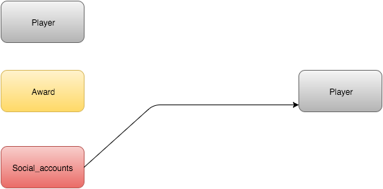

Parts Implemented by Kerim YILDIRIM
===================================

Database Tables
---------------

      Fig. 1: Entity Relationship Diagram of the Players/Awards/Social_accounts tables.

3 tables are used to hold Players/Awards/Social_accounts data.
Players has no reference.
Awards has no reference.
Social_accounts references Players.

Player:
*******

.. code-block:: plpgsql

   CREATE TABLE players ( ID VARCHAR(100) NOT NULL,
   FIRSTNAME VARCHAR(100),
   LASTNAME VARCHAR(100),
   AGE INT,
   GENDER VARCHAR(100),
   EMAIL VARCHAR(100),
   NATIONALITY VARCHAR(100),
   TURNED_PRO VARCHAR(100),
   LOCATION VARCHAR(100),
   NICKNAME VARCHAR(100),
   MLE VARCHAR(100),
   BIRTHDAY VARCHAR(100),
   PRIMARY KEY (ID))

players table holds the information about players.
Many of the attributes are very easy to get,
but MLE and TURNED_PRO may confuse you.
MLE means money list earnings and it stores how much the player earns.
TURNED_PRO stores when the player turned to professional one.

Award:
******

.. code-block:: plpgsql

   CREATE TABLE awards ( ID VARCHAR(100) NOT NULL,
   Description VARCHAR(250),
   LastWinnerID VARCHAR(100) REFERENCES awards (ID),
   PRIMARY KEY (ID))

awards table holds the information about awards.
Description stores a brief information about award.
LastWinnerID stores last winner id.

Social_accounts
***************

.. code-block:: plpgsql

      CREATE TABLE social_accounts (ID VARCHAR(100) REFERENCES players (ID),
      TwitterLink VARCHAR(20),
      InstagramLink VARCHAR(20),
      FacebookLink VARCHAR(20),
      PRIMARY KEY (ID))

social_accounts table holds the information about social accounts.
TwitterLink stores twitter account link.
InstagramLink stores instagram account link.
FacebookLink stores facebook account link.

Class file of Players:
**********************
.. code-block:: python

   class Player:

    def __init__(self, id, firstname, lastname, age, gender, email, nationality, turned_pro, location, nickname, money_list_earnings, birthday):
        self.ID = id
        self.FirstName = firstname
        self.LastName = lastname
        self.Age = age
        self.Gender = gender
        self.Email = email
        self.Nationality = nationality
        self.TurnedPro = turned_pro
        self.Location = location
        self.Nickname = nickname
        self.MoneyListEarnings = money_list_earnings
        self.Birthday = birthday
        self.Facebook = '#'
        self.Twitter = '#'
        self.Instagram = '#'

    def getID(self):
        return self.ID

    def getFirstName(self):
        return self.FirstName

    def getLastName(self):
        return self.LastName

    def getAge(self):
        return self.Age

    def getGender(self):
        return self.Gender

    def getEmail(self):
        return self.Email

    def getNationality(self):
        return self.Nationality

    def getTurnedPro(self):
        return self.TurnedPro

    def getLocation(self):
        return self.Location

    def getNickname(self):
        return self.Nickname

    def getMoneyListEarnings(self):
        return self.MoneyListEarnings

    def getBirthday(self):
        return self.Birthday

Class file of Awards:
*********************
.. code-block:: python

   class Award:

    def __init__(self, id, description, lastWinnerID):
        self.ID = id
        self.Description = description
        self.LastWinnerID = lastWinnerID

    def getID(self):
        return self.ID

    def getDescription(self):
        return self.Description

    def getLastWinnerID(self):
        return self.LastWinnerID

Class file of Social accounts:
******************************

.. code-block:: python

   class Social_accounts:

    def __init__(self, id, twitterLink, instagramLink, facebookLink):
        self.ID = id
        self.TwitterLink = twitterLink
        self.InstagramLink = instagramLink
        self.FacebookLink = facebookLink

    def getID(self):
        return self.ID

    def getTwitterLink(self):
        return self.TwitterLink

    def getInstagramLink(self):
        return self.InstagramLink

    def getFacebookLink(self):
        return self.FacebookLink

Players related part of server.py file:
***************************************

.. code-block:: python

   @app.route('/players')
   def fplayers():
    with dbapi2.connect(app.config['dsn']) as connection:
        _playerList = dbmanager.getPlayers(connection)
        _sponsorList = dbmanager.getSponsor(connection)
        _channelList = dbmanager.getChannels(connection)
        _info = layoutInfo('The game of snooker has been everything to me.','RONNIE O-SULLIVAN','static/img/players.jpg')
        return render_template('fplayers.html', playerList = _playerList, info = _info, sponsorList = _sponsorList, channelList = _channelList)

   @app.route('/admin_panel/player', methods=['GET','POST'])
   def player():
    with dbapi2.connect(app.config['dsn']) as connection:

        if(request.method == 'GET'):
            _playerList = dbmanager.getPlayers(connection)
            return render_template('player.html', playerList = _playerList)

        if(request.form["action"] == "add_player_action"):
            dbmanager.addPlayer(request.form['add_firstname'], request.form['add_lastname'], int(request.form['add_age']), request.form['add_gender'],request.form['add_email'],request.form['add_nationality'],request.form['add_turned_pro'],request.form['add_location'],request.form['add_nickname'],request.form['add_money_list_earnings'],request.form['add_birthday'], connection)
            return redirect(url_for('player'))

        if(request.form["action"] == "delete_player_action"):
            dbmanager.deletePlayer(request.form['id'], connection)
            return redirect(url_for('player'))

Awards related part of server.py file:
**************************************
.. code-block:: python

   @app.route('/admin_panel/award', methods=['GET','POST'])
   def award():
    with dbapi2.connect(app.config['dsn']) as connection:
        if(request.method == 'GET'):
            _awardList = dbmanager.getAwards(connection)
            return render_template('award.html', awardList = _awardList)

        if(request.form["action"] == "add_award_action"):
            dbmanager.addAward(request.form['add_desc'], request.form['add_last_winner_id'], connection)
            return redirect(url_for('award'))

        if(request.form["action"] == "delete_award_action"):
            dbmanager.deleteAward(request.form['id'], connection)
            return redirect(url_for('award'))

        return render_template('award.html')

Social accounts related part of server.py file:
***********************************************
.. code-block:: python

   @app.route('/admin_panel/social_accounts', methods=['GET','POST'])
   def social_accounts():
    with dbapi2.connect(app.config['dsn']) as connection:
        if(request.method == 'GET'):
            _socialAccountsList = dbmanager.getSocialAccounts(connection)
            return render_template('social_accounts.html', socialAccountsList = _socialAccountsList)

        if(request.form["action"] == "add_social_accounts_action"):
            dbmanager.addSocialAccounts(request.form['add_twitter_account'], request.form['add_instagram_account'], request.form['add_facebook_account'], connection)
            return redirect(url_for('social_accounts'))

        if(request.form["action"] == "delete_social_accounts_action"):
            dbmanager.deleteSocialAccounts(request.form['id'], connection)
            return redirect(url_for('social_accounts'))

        return render_template('social_accounts.html')

Players related part of dbmanager.py file:
******************************************
.. code-block:: python

   def createPlayersTable():

    conn = psycopg2.connect(conn_string)

    cursor = conn.cursor()

    cursor.execute("CREATE TABLE players ( ID VARCHAR(100) NOT NULL,FIRSTNAME VARCHAR(100), LASTNAME VARCHAR(100), AGE INT, GENDER VARCHAR(100), EMAIL VARCHAR(100), NATIONALITY VARCHAR(100), TURNED_PRO VARCHAR(100), LOCATION VARCHAR(100), NICKNAME VARCHAR(100), MLE VARCHAR(100), BIRTHDAY VARCHAR(100), PRIMARY KEY (ID))")

    conn.commit()

   def getPlayers(conn):

    cursor = conn.cursor()

    cursor.execute("SELECT * FROM players ")

    playerList = []

    row = cursor.fetchone()
    while row:

       _player = Player(row[0],row[1],row[2],row[3],row[4],row[5],row[6],row[7],row[8],row[9],row[10],row[11])

       playerList.append(_player)

       row = cursor.fetchone()

    """Getting social information of players from social_accounts table"""
    for temp_player in playerList:
        cursor.execute("SELECT * FROM social_accounts WHERE id = '%s'"%(temp_player.getID()))
        row2 = cursor.fetchone()
        #temp_player.Twitter = row2[1]
        #temp_player.Instagram = row2[2]
        #temp_player.Facebook = row2[3]

    return playerList

   def getPlayer(id,conn):

    cursor = conn.cursor()

    cursor.execute("SELECT * FROM players WHERE id = '%s'"%(id))

    row = cursor.fetchone()

    _player = Player(row[0],row[1],row[2],row[3],row[4],row[5],row[6],row[7],row[8],row[9],row[10])

    return _player

   def addPlayer(firstname, lastname, age, gender, email, nationality, turned_pro, location, nickname, money_list_earnings, birthday, conn):

    try:

        cursor = conn.cursor()

        cursor.execute("INSERT INTO players VALUES('%s','%s','%s','%d','%s','%s','%s','%s','%s','%s','%s','%s')"%(utils.generateID(), firstname, lastname, age, gender, email, nationality, turned_pro, location, nickname, money_list_earnings, birthday))

        conn.commit()

    except Exception as e:
        print(e)
        pass

   def deletePlayer(id, conn):

    cursor = conn.cursor()

    cursor.execute("DELETE FROM players WHERE id = '%s'"%(id))

    conn.commit()

   def addPlayerSocial(player_id,twitter_url,instagram_url,facebook_url,conn):

    cursor = conn.cursor()

    created_id = utils.generateID()

    cursor.execute("INSERT INTO social_accounts VALUES('%s','%s','%s','%s')"%(created_id, twitter_url, instagram_url, facebook_url))

    conn.commit()

   def deletePlayerSocial(id,conn):
    cursor = conn.cursor()

    cursor.execute("DELETE FROM social_accounts WHERE id = '%s'"%(id))

    conn.commit()

Awards related part of dbmanager.py file:
*****************************************
.. code-block:: python

   def createAwardTable():

    conn = psycopg2.connect(conn_string)

    cursor = conn.cursor()

    cursor.execute("CREATE TABLE awards ( ID VARCHAR(100) NOT NULL,Description VARCHAR(250),LastWinnerID VARCHAR(100) REFERENCES awards (ID),PRIMARY KEY (ID))")

    conn.commit()

   def getAwards(conn):

    cursor = conn.cursor()

    cursor.execute("SELECT * FROM awards")

    awardList = []

    row = cursor.fetchone()
    while row:

       temp_award = Award(row[0],row[1],row[2])

       awardList.append(temp_award)

       row = cursor.fetchone()

    return awardList

   def getAward(id, conn):

    cursor = conn.cursor()

    cursor.execute("SELECT * FROM awards WHERE id = '%s'"%(id))

    row = cursor.fetchone()

    award = Award(row[0],row[1],row[2])

    return award

   def addAward(description, last_winner_id, conn):

    try:

        cursor = conn.cursor()

        cursor.execute("INSERT INTO awards VALUES('%s','%s','%s')"%(utils.generateID(),description,last_winner_id))

        conn.commit()
        return 'OK'

    except Exception as e:
        print(str(e))
        pass

   def deleteAward(id, conn):

    cursor = conn.cursor()

    cursor.execute("DELETE FROM awards WHERE id = '%s'"%(id))

    conn.commit()

Social accounts related part of dbmanager.py file:
**************************************************
.. code-block:: python

   def createSocialAccountsTable():

    conn = psycopg2.connect(conn_string)

    cursor = conn.cursor()

    cursor.execute("CREATE TABLE social_accounts (ID VARCHAR(100) REFERENCES players (ID), TwitterLink VARCHAR(20), InstagramLink VARCHAR(20), FacebookLink VARCHAR(20), PRIMARY KEY (ID))")

    conn.commit()

   def getSocialAccounts(conn):

    cursor = conn.cursor()

    cursor.execute("SELECT * FROM social_accounts")

    socialAccountsList = []

    row = cursor.fetchone()
    while row:

       social_account = Social_accounts(row[0],row[1],row[2],row[3])

       socialAccountsList.append(social_account)

       row = cursor.fetchone()

    return socialAccountsList

   def addSocialAccounts(twitter_account, instagram_account, facebook_account, conn):

    try:

        cursor = conn.cursor()

        cursor.execute("INSERT INTO social_accounts VALUES('%s','%s','%s','%s')"%(utils.generateID(), twitter_account, instagram_account, facebook_account))

        conn.commit()

    except Exception as e:
        print(str(e))
        pass

   def deleteSocialAccounts(id, conn):

    cursor = conn.cursor()

    cursor.execute("DELETE FROM social_accounts WHERE id = '%s'"%(id))

    conn.commit()

