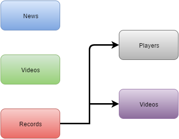

Parts Implemented by UĞUR BÜYÜKYILMAZ
=====================================

Database Tables
---------------

      Fig. 1: ER Diagram of the News/Records/Videos tables.

3 tables are used to represent News/Records/Videos data.
2 tables have no foreign keys which are News and Videos.
Records table have 2 foreign keys referencing to Players and Videos table.

News:
*****

.. code-block:: plpgsql

   CREATE TABLE news ( ID VARCHAR(100) NOT NULL,
   Title VARCHAR(100),
   Content VARCHAR(250),
   ImageUrl VARCHAR,
   ExternalUrl VARCHAR,
   Date VARCHAR(20),
   PRIMARY KEY (ID))

News table is responsible for keeping news data.
It keeps the title, content of the news, and also a Image URL related to the news, and an external URL to an external link and the date that it is published.

Records:
********

.. code-block:: plpgsql

   CREATE TABLE records (ID VARCHAR(100) NOT NULL,
   Description VARCHAR(200),
   PlayerID VARCHAR(100) REFERENCES players (ID),
   VideoID VARCHAR(10) REFERENCES videos (ID),
   Date VARCHAR(20),
   PRIMARY KEY (ID))

Records table is responsible for keeping the records information such as description, the PlayerID who has the record, a video to the record and a date.

Videos
******

.. code-block:: plpgsql

      CREATE TABLE videos (ID VARCHAR(100) NOT NULL,
      Title VARCHAR(100),
      ExtUrl VARCHAR,
      SourceType VARCHAR(10),
      PRIMARY KEY (ID))

Videos table is responsible for keeping the information about videos, such as title, external link to the video and a source type about where it is hosted.

Class file of News:
*******************
.. code-block:: python

   class News:

    def __init__(self, id, title, content, image_url, date):
        self.ID = id
        self.Title = title
        self.Content = content
        self.ImageUrl = image_url
        self.Date = date

    def getID(self):
        return self.ID

    def getTitle(self):
        return self.Title

    def getContent(self):
        return self.Content

    def getImageUrl(self):
        return self.ImageUrl

    def getDate(self):
        return self.Date

Class file of Records:
**********************
.. code-block:: python

   class Record:

    def __init__(self, id, description, player_id, video_id, date):
        self.ID = id
        self.Description = description
        self.PlayerID = player_id
        self.VideoID = video_id
        self.Date = date
        self.PlayerName = " "
        self.VideoUrl = " "

    def getID(self):
        return self.ID

    def getDescription(self):
        return self.Description

    def getPlayerID(self):
        return self.PlayerID

    def getPlayerName(self):
        return self.PlayerName

    def getVideoUrl(self):
        return self.VideoUrl

    def getVideoID(self):
        return self.VideoID

    def getYear(self):
        return self.Date

Class file of Videos:
*********************
.. code-block:: python

   class Video:

    def __init__(self, id, title, ext_url, source_type):
        self.ID = id
        self.Title = title
        self.ExtUrl = ext_url
        self.SourceType = source_type

    def getID(self):
        return self.ID

    def getTitle(self):
        return self.Title

    def getExtUrl(self):
        return self.ExtUrl

    def getSourceType(self):
        return self.SourceType

Server.py News part:
********************
.. code-block:: python

   @app.route('/news')
   def news():
    with dbapi2.connect(app.config['dsn']) as connection:
        _newsList = dbmanager.getNews(connection)
        _sponsorList = dbmanager.getSponsor(connection)
        _channelList = dbmanager.getChannels(connection)
        _info = layoutInfo('All about Snooker','Daily News for Snooker','static/img/home-bg.jpg')
        return render_template('fnews.html', newsList = _newsList, info = _info, sponsorList = _sponsorList, channelList = _channelList)

   @app.route('/news/<newsid>')
   def newsDetail(newsid):
    with dbapi2.connect(app.config['dsn']) as connection:
        _news = dbmanager.getNewsWithID(newsid,connection)
        _sponsorList = dbmanager.getSponsor(connection)
        _channelList = dbmanager.getChannels(connection)
        _info = layoutInfo(_news.getTitle(),'',_news.getImageUrl())
        _comments = dbmanager.getComments(newsid,connection)
        return render_template('/fnews_detail.html',news = _news, info = _info, commentList = _comments, sponsorList = _sponsorList, channelList = _channelList)

   @app.route('/news/addcomment', methods=['GET','POST'])
   def addCommentToNews():
    with dbapi2.connect(app.config['dsn']) as connection:
        news_id = ""
        if(request.form["action"] == "Add Comment"):
            _newsid = request.form['newsid']
            user_id = session.get('loggedUser')
            dbmanager.addComment(user_id,_newsid,request.form['comment_title'], request.form['comment_content'],datetime.datetime.now().strftime("%Y-%m-%d %H:%M:%S"), connection)

        return redirect(url_for('newsDetail', newsid = _newsid))

        @app.route('/admin_panel/news', methods=['GET','POST'])

   def addNews():
    with dbapi2.connect(app.config['dsn']) as connection:

        if(request.method == 'GET'):
            _newsList = dbmanager.getNews(connection)
            return render_template('news.html', newsList = _newsList)

        if(request.form["action"] == "add_news_action"):
            dbmanager.addNews(request.form['news_title'], request.form['message'], request.form['news_imageurl'], request.form['news_date'], connection)
            return redirect(url_for('addNews'))

        if(request.form["action"] == "delete_news_action"):
            dbmanager.deleteNews(request.form['id'], connection)
            return redirect(url_for('addNews'))

Server.py Records part:
***********************
.. code-block:: python

   @app.route('/records')
   def frecords():
    with dbapi2.connect(app.config['dsn']) as connection:
        _recordList = dbmanager.getRecords(connection)
        _sponsorList = dbmanager.getSponsor(connection)
        _channelList = dbmanager.getChannels(connection)
        _info = layoutInfo('Never mind what others do; do better than yourself.','RONNIE O-SULLIVAN','static/img/players.jpg')
        return render_template('frecords.html', recordList = _recordList, info = _info, sponsorList = _sponsorList, channelList = _channelList)

   @app.route('/admin_panel/record', methods=['GET','POST'])
   def addRecord():
    with dbapi2.connect(app.config['dsn']) as connection:
        if(request.method == 'GET'):
            _recordList = dbmanager.getRecords(connection)
            return render_template('record.html', recordList = _recordList)

        if(request.form["action"] == "add_record_action"):
            dbmanager.addRecord(request.form['record_desc'], request.form['player_name'], request.form['video_url'],request.form['record_date'] ,connection)
            return redirect(url_for('addRecord'))

        if(request.form["action"] == "delete_record_action"):
            dbmanager.deleteRecord(request.form['id'], connection)
            return redirect(url_for('addRecord'))

        return render_template('record.html')

Server.py Videos part:
**********************
.. code-block:: python

   @app.route('/admin_panel/video', methods=['GET','POST'])
   def addVideo():
    with dbapi2.connect(app.config['dsn']) as connection:
        if(request.method == 'GET'):
            _videoList = dbmanager.getVideos(connection)
            return render_template('video.html', videoList = _videoList)

        if(request.form["action"] == "add_video_action"):
            dbmanager.addVideo(request.form['add_video_title'], request.form['add_ext_url'], request.form['add_source_type'],connection)
            return redirect(url_for('addVideo'))

        if(request.form["action"] == "delete_video_action"):
            dbmanager.deleteVideo(request.form['id'], connection)
            return redirect(url_for('addVideo'))

        return render_template('video.html')

dbmanager.py News part:
***********************
.. code-block:: python

   def createNewsTable():

    conn = psycopg2.connect(conn_string)

    cursor = conn.cursor()

    cursor.execute("CREATE TABLE news ( ID VARCHAR(100) NOT NULL,Title VARCHAR(100),Content VARCHAR(250),ImageUrl VARCHAR,ExternalUrl VARCHAR,Date VARCHAR(20),PRIMARY KEY (ID))")

    conn.commit()

   def getNews(conn):

    cursor = conn.cursor()

    cursor.execute("SELECT * FROM news")

    newsList = []

    row = cursor.fetchone()
    while row:

       temp_news = News(row[0],row[1],row[2],row[3],row[4])

       newsList.append(temp_news)

       row = cursor.fetchone()

    return newsList

   def getNewsWithID(id,conn):

    cursor = conn.cursor()

    cursor.execute("SELECT * FROM news WHERE id = '%s'"%(id))

    row = cursor.fetchone()

    news = News(row[0],row[1],row[2],row[3],row[4])

    return news

   def addNews(title, content, image_url, date, conn):

    try:

        cursor = conn.cursor()

        cursor.execute("INSERT INTO news VALUES('%s','%s','%s','%s','%s')"%(utils.generateID(), title, content, image_url, date))

        conn.commit()

    except Exception as e:
        print(str(e))
        pass

   def deleteNews(id, conn):

    cursor = conn.cursor()

    cursor.execute("DELETE FROM news WHERE id = '%s'"%(id))

    conn.commit()

dbmanager.py Records part:
**************************
.. code-block:: python

   def createRecordTable():

    conn = psycopg2.connect(conn_string)

    cursor = conn.cursor()

    cursor.execute("CREATE TABLE records (ID VARCHAR(100) NOT NULL,Description VARCHAR(200),PlayerID VARCHAR(100) REFERENCES players (ID),VideoID VARCHAR(10) REFERENCES videos (ID),Date VARCHAR(20),PRIMARY KEY (ID))")

    conn.commit()

   def getRecords(conn):

    cursor = conn.cursor()

    cursor.execute("SELECT * FROM records")

    recordList = []

    row = cursor.fetchone()
    while row:

       record = Record(row[0],row[1],row[2],row[3],row[4])

       temp_player = getPlayer(record.PlayerID, conn)
       temp_video = getVideo(record.VideoID, conn)

       record.PlayerName = temp_player.FirstName + " " + temp_player.LastName
       record.VideoUrl = temp_video.ExtUrl

       recordList.append(record)

       row = cursor.fetchone()

    return recordList

   def addRecord(description, player_name, video_url, date,conn):

    try:

        cursor = conn.cursor()

        cursor.execute("SELECT ID FROM players WHERE name = '%s'"%(player_name))

        player_id = cursor.fetchone()

        cursor.execute("SELECT ID FROM videos WHERE name = '%s'"%(video_url))

        video_id = cursor.fetchone()

        cursor.execute("INSERT INTO records VALUES('%s','%s','%s','%s','%s')"%(utils.generateID(), description, player_id, video_id, date))

        conn.commit()

    except Exception as e:
        print(str(e))
        pass

   def deleteRecord(id,conn):

    cursor = conn.cursor()

    cursor.execute("DELETE FROM records WHERE id = '%s'"%(id))

    conn.commit()

dbmanager.py Videos part:
*************************
.. code-block:: python

   def createVideosTable():

    conn = psycopg2.connect(conn_string)

    cursor = conn.cursor()

    cursor.execute("CREATE TABLE videos (ID VARCHAR(100) NOT NULL,Title VARCHAR(100),ExtUrl VARCHAR,SourceType VARCHAR(10),PRIMARY KEY (ID))")

    conn.commit()

   def getVideos(conn):

    cursor = conn.cursor()

    cursor.execute("SELECT * FROM videos ")

    videoList = []

    row = cursor.fetchone()
    while row:

       video = Video(row[0],row[1],row[2],row[3])

       videoList.append(video)

       row = cursor.fetchone()

    return videoList

   def getVideo(id,conn):

    cursor = conn.cursor()

    cursor.execute("SELECT * FROM videos WHERE id = '%s' "%(id))

    row = cursor.fetchone()

    video = Video(row[0],row[1],row[2],row[3])

    return video

   def addVideo(title, ext_url, source_type,conn):

    try:

        cursor = conn.cursor()

        cursor.execute("INSERT INTO videos VALUES('%s','%s','%s','%s')"%(utils.generateID(), title, ext_url, source_type))

        conn.commit()

    except Exception as e:
        print(str(e))
        pass

   def deleteVideo(id,conn):

    cursor = conn.cursor()

    cursor.execute("DELETE FROM videos WHERE id = '%s'"%(id))

    conn.commit()
