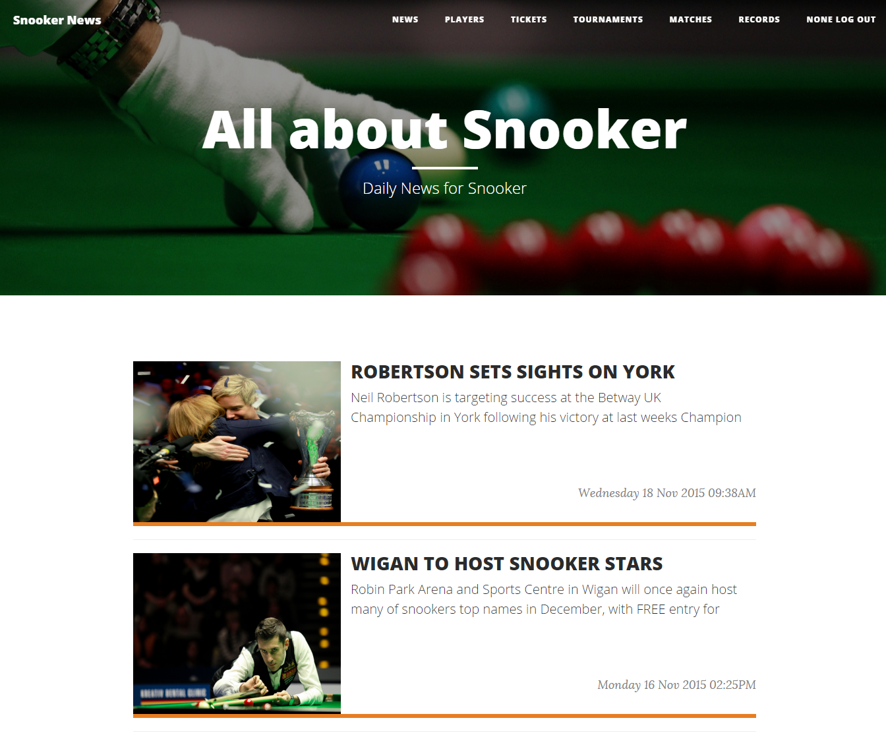
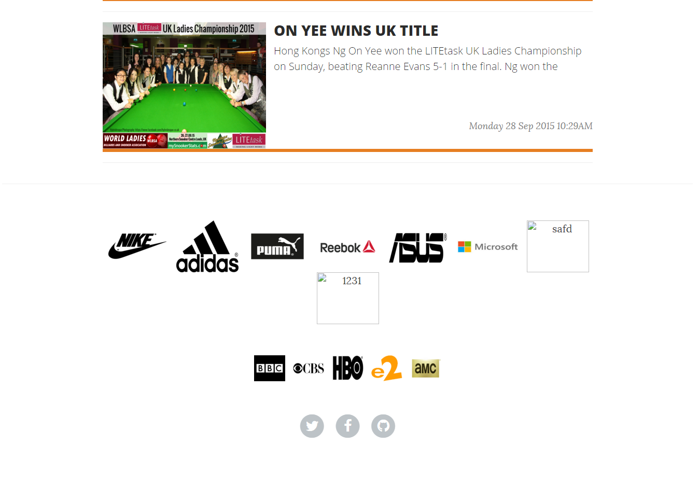

User Guide
==========

Main Page
---------

      Fig. 1.2: Screenshot of Home Page

Main Page consists of Home button in the top left corner, Navigation bar and Login button in the top right corner and a header part on top of the content.  The navigation bar includes News, Players, Tickets, Tournaments, Matches and Records. When any of this menu items is clicked, then the relevant content is brought to the content part.

In the footer section of the webpage, the sponsors for the tournaments are shown, and their logos are linked to the company websites. Below that, the TV channels to watch Snooker tournaments are shown, and also their logos are linked to the channel websites, and in the bottom there are social media icons for our webpage which are linked to the social media links, and also a logo linkins to GitHub page. The footer screen shot is below:

      Fig. 1.2: Screenshot of Footer

.. toctree::

   member1
   member2
   member3
   member4
   member5
