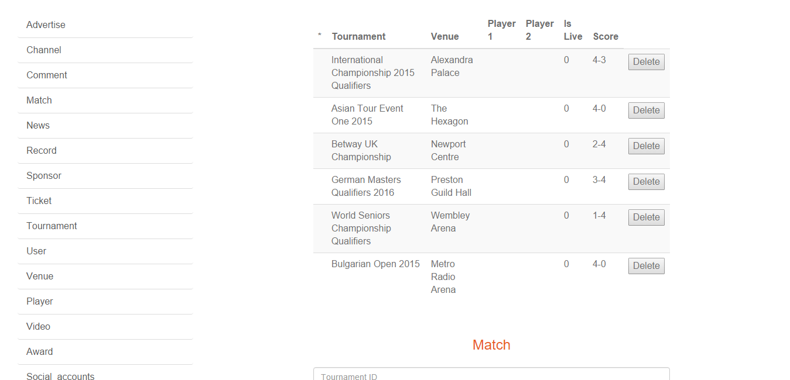
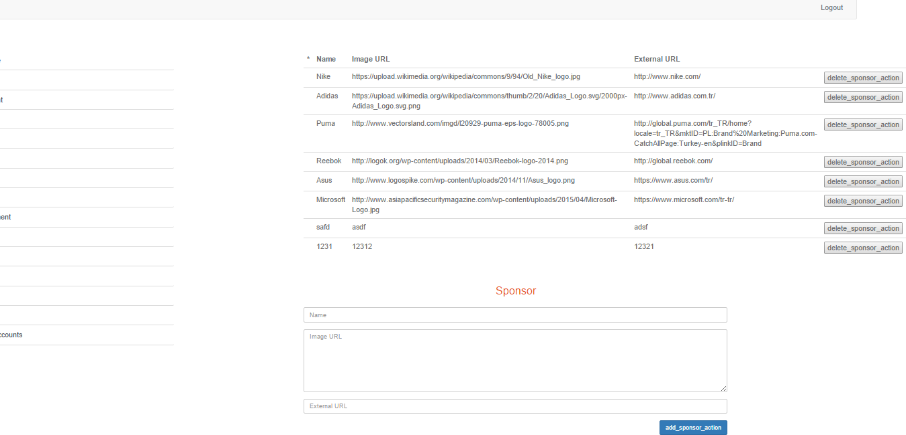
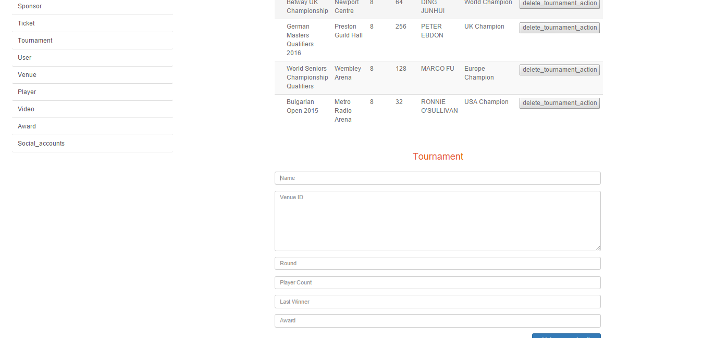

Parts Implemented by ANIL YILDIRIM
==================================

Matches
=======
This page are used for listing and managing the information related to the matches.

/matches
--------
The page for adding and managing match informations.

      Fig. 1.1: Screenshot from /matches page.

The current data related to the matches are listed above the screen.
The information contains Tournament, Venue, Player1, Player2, Is Live and Score for this match.
Tournament is the tournament which the related match belongs to.
Venue is the place where the match is held.
Player1 and Player2 are the player ID's.
Is Live is the field to store if the Match is live or not.
Score is the field to store the score of the match.

There is a button attached to every entry to delete it from database.

Under this data table, there is a form part to add new matches to the database.
The button Add Match is used to complete the event.

Sponsors
========
This page are used for listing and managing the information related to the sponsors.

/sponsors
---------
The page for adding and managing match informations.

      Fig. 1.2: Screenshot from /sponsor page.

The current data related to the sponsors are listed above the screen.
The information contains Name, Image URL, External URL for this sponsor.
Name contains the name of the Brand.
Image URL contains a URL to the logo of the brand.
External URL contains a URL to the website of the brand.

There is a button attached to every entry to delete it from database.

Under this data table, there is a form part to add new sponsors to the database.
The button Add Sponsor is used to complete the event.

Tournaments
===========
This page is used for listing and managing the information related to the tournaments.

/tournament
-----------
The page for adding and managing tournament informations.

      Fig. 1.3: Screenshot from /tournament page.

The current data related to the tournaments are listed above the screen.
The information contains Name, Venue, Round, Player Count, Last Winner and Award for this tournament.
Name contains the name of the tournament.
Venue contains the place where the tournament is held.
Round is responsible for storing number of rounds for this tournament.
Player count is the total number of player attending to this tournament.
Last winner is the player ID of the player that won the tournament last time.
Award is the name of the award that will be given to the winner.

There is a button attached to every entry to delete it from database.

Under this data table, there is a form part to add new tournaments to the database.
The button Add Tournament is used to complete the event.