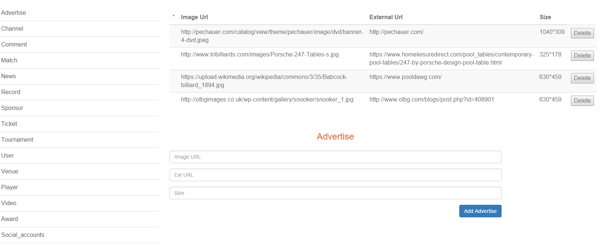

Parts Implemented by IŞIN KIRBAŞ
==================================

User
=======
User page is used to list and manage the information of users.

/user
--------
The page for adding and deleting user information.

.. figure:: static/Users.png
      :scale: 80 %
      :alt: Screenshot of User Admin Panel Page
      
      Fig. 2.1: Screenshot from /user page.

The current data about users are listed on top of the page.
The information contains First Name, Last Name, Age, Gender, Email and Account Type for users.
First Name, Last Name, Age, Gender and Email are basic personal fields of User.
Account Type stands for type of User and it can be King or User. King is used for Admins and User is used for ordinary users.

There is a button attached to every user to delete it from database.

Below this data list, there is an input form to add new users to the database.
Add User button is used to complete the addition.

Advertise
=========
This page is used to list and manage the information of advertise.

/advertise
---------
The page for adding and deleting advertise information.

      Fig. 2.2: Screenshot from /advertise page.

The current data about advertise are listed on top of the page.
The information contains Image URL, External URL and size of advertise.
Image URL contains a URL to the picture of advertise.
External URL contains a URL to the website of the brand.
Size scales the image of advertise.

There is a button attached to every entry to delete it from database.

Under this data list, there is an input form to add new advertises to the database.
Add Advertise button is used to complete the addition.

Comment
===========
This page is used to list and manage the information of comments.

/comment
-----------
The page for adding and deleting comment information.

.. figure:: static/comment.png
      :scale: 80 %
      :alt: Screenshot of Comment Admin Panel Page
      Fig. 2.3: Screenshot from /comment page.

The current data about comments are listed on top of the page.
The information contains Username, Title, Content and Date for this comment.
Username is the username of the person who wrote the comment.
Title is the title of comment.
Content is the essential part of the comment.
Date states the date that comment has made.

There is a button attached to every entry to delete it from database.

Under this data list, there is an input form to add new comments to the database.
Add Comment button is used to complete the addition.
