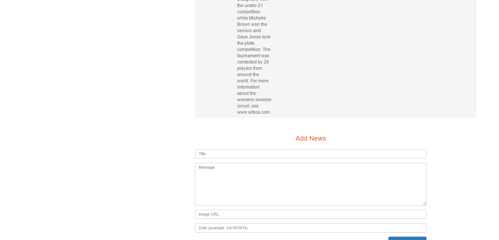

Parts Implemented by İLKER YAĞMUR
=================================

Venue
=====
This page is to list and manage information about venues.

/venue
------
The page used to create and delete venues.

      Fig. 1: Screenshot of /news.

Information taken from the database is listed on the upper part of the page.
The table has four columns: Name, Capacity, Location and Description.
Name contains the name of the venue.
Capacity states the number of people that venue can carry.
Location is the country which venue takes place.
Description is brief information about venue.

The delete button on the right side of every venue item is used to delete it from the database.

In the lower part of the content screen, there is a form to insert new venues to the database.
add_venue_action is clicked to insert and complete the operation.

Ticket
======
This page is to list and manage ticket data.

/ticket
-------
The page used to create and delete ticket data.

.. figure:: static/ticket.png
      :scale: 80 %
      :alt: Admin Panel Screen Shot of /ticket Page

      Fig. 1: Screenshot of /ticket.

Information taken from the database is listed on the upper part of the page.
The table has siz columns: Title, Venue, Content, Price, Date and External Url.
Title contains name of the event that ticket belongs to.
Venue contains name of the place where event held.
Content contains a summary of the event.
Price shows how much the ticket costs.
Date shows the time interval when the event held.
Extarnel Url shows the web address of the event.

The delete button on the right side of every ticket item is used to delete it from the database.

In the lower part of the content screen, there is a form to insert new tickets to the database.
add_ticket_action clicked to insert and complete the operation.

Channel
=======
This page is to list and manage channel data.

/channel
--------
The page used to create and delete channel data.

.. figure:: static/channel.png
      :scale: 80 %
      :alt: Admin Panel Screen Shot of /channel Page

      Fig. 1: Screenshot of /channel.

Information taken from the database is listed on the upper part of the page.
The table has three columns: Name, Image Url and External Url.
Name contains name of the channel.
Image Url contains address of channel logo.
External Url contains a Url to reach the channel website.

The delete button on the right side of every Channel item is used to delete it from the database.

In the lower part of the content screen, there is a form to insert new channels to the database.
Add Channel is clicked to insert and complete the operation.

