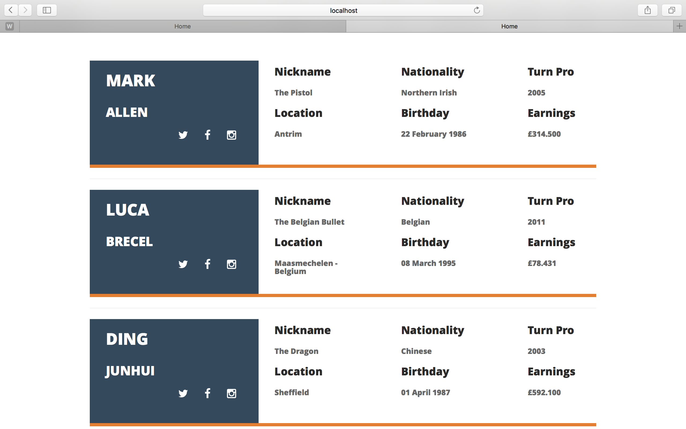
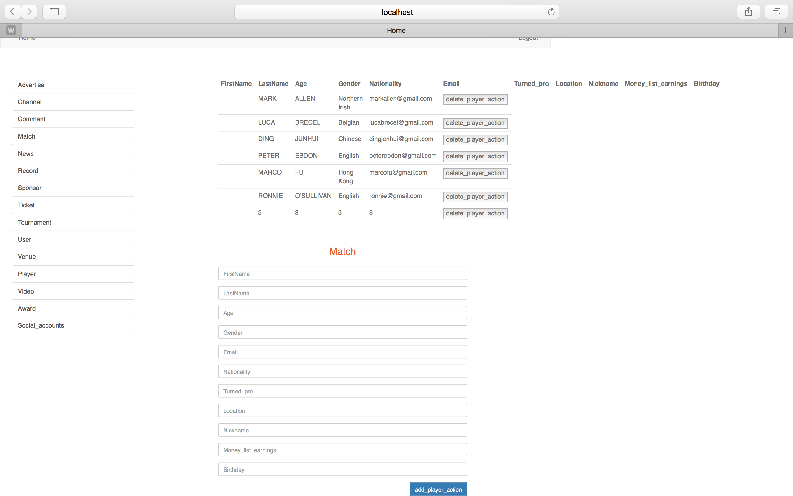
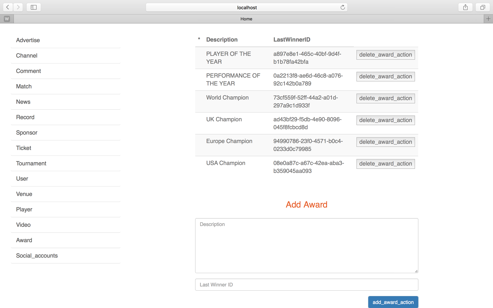
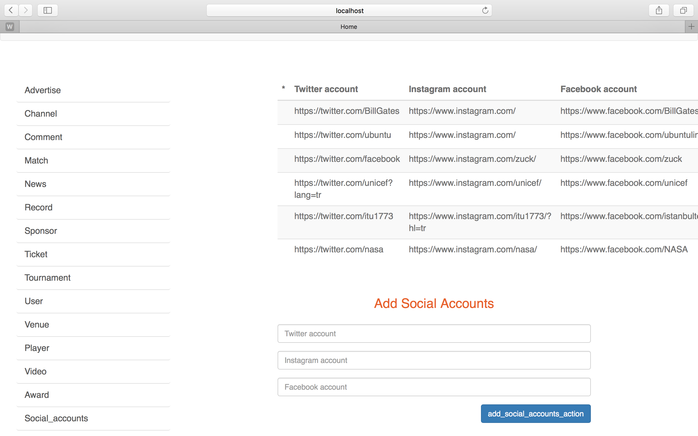

Parts Implemented by Kerim YILDIRIM
===================================

Player
======
You can see the information of the players in http://itucsdb1504.mybluemix.net/players.
Also you can see the view of the page with respect to the image below.

      Fig. 4.1: Screenshot from /players.

You can add new players and delete the existing players in http://itucsdb1504.mybluemix.net/admin_panel/player.
You can see the page view with respect to the image below.

      Fig. 4.2: Screenshot from /admin_panel/player.

In order to delete a player from database, you just need to press the delete_player_action button,
but when it comes to adding a new player you must fill the fields at the bottom of the page.
I set all fields as required, therefore you must fill every single one.
Most of the fields are very easy to get like FirstName, Age, Gender etc.
but Turned_pro and Money_list_earnings can make you get confused.
Turned_pro means when the player has become professional.
Money_list_earnings means how much the player earns.
After you fill every single field, you just need to press the add_player_action button
in order to add the player to database.

Award
=====
You can add new awards and delete the existing awards in http://itucsdb1504.mybluemix.net/admin_panel/award.
You can see the page view with respect to the image below.

      Fig. 4.2: Screenshot from /admin_panel/award.

In order to delete a award from database, you just need to press the delete_award_action button,
but when it comes to adding a new player you must fill the fields at the bottom of the page.
I set all fields as required, therefore you must fill every single one
as description and last winner id.
After you fill every single field, you just need to press the add_award_action button
in order to add the award to database.

In addition, awards are shown in http://itucsdb1504.mybluemix.net/tournaments and
http://itucsdb1504.mybluemix.net/matches because it is key for tournament and match objects.

Social accounts
===============
You can add new socail accounts and delete the existing social accounts
in http://itucsdb1504.mybluemix.net/admin_panel/social_accounts.
You can see the page view with respect to the image below.

      Fig. 4.3: Screenshot from /admin_panel/social_accounts.

In order to delete social accounts from database, you just need to press the delete_social_accounts_action button,
but when it comes to adding new social accounts you must fill the fields at the bottom of the page.
I set all fields as required, therefore you must fill every single one
as twitter account, instagram account and facebook account.
After you fill every single field, you just need to press the add_social_accounts_action button
in order to add the social accounts to database.

In addition, you can see social accounts of the players by clicking on the images of the social platforms
shown in http://itucsdb1504.mybluemix.net/players.