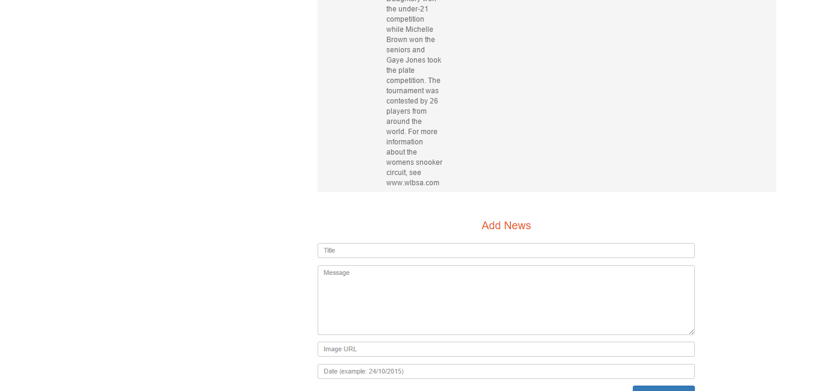

Parts Implemented by UĞUR BÜYÜKYILMAZ
=====================================

News
====
This page is to list and manage news data.

/news
-----
The page used to create and delete news data.

      Fig. 5.1: Screenshot of /news.

Information taken from the database is listed on the upper part of the content screen.
The table has these columns: Title, Content, ImageURL, Date.
Title contains the title of the news.
Content contains the content part of the news.
ImageURL is used to store a URL which will be shown with this particular news.
Date is the publish date of the news.

The delete button on the right side of every News item is used to delete it from the database.

In the lower part of the content screen, there is a form to insert new news to the database.
Add News is clicked to insert and complete the operation.

Records
=======
This page is to list and manage records data.

/record
-------
The page used to create and delete records data.

Information taken from the database is listed on the upper part of the content screen.
The table has these columns: Description, Player ID, Video ID, Date.
Description contains the additional information related to the particular record.
Player ID contains the information of which the record belongs to.
Video ID contains a video URL for the record to watch.
Date stores the date which the record is obtained.

The delete button on the right side of every Record item is used to delete it from the database.

In the lower part of the content screen, there is a form to insert new records to the database.
Add Records is clicked to insert and complete the operation.

Videos
======
This page is to list and manage videos data.

/video
------
The page used to create and delete videos data.

      Fig. 5.3: Screenshot of /video.

Information taken from the database is listed on the upper part of the content screen.
The table has these columns: Title, External URL, Source Type.
Title contains the video title.
External URL contains a URL to watch the video online.
Source type is used to store the data of the host of the video.

The delete button on the right side of every Video item is used to delete it from the database.

In the lower part of the content screen, there is a form to insert new videos to the database.
Add Videos is clicked to insert and complete the operation.
